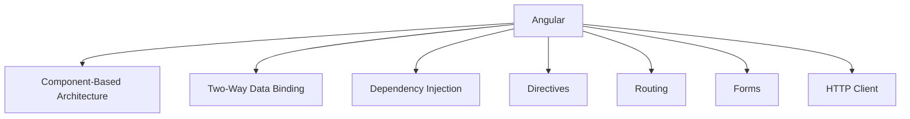

# Introduction to Angular

## What is Angular?

Angular is a platform and framework for building single-page client applications using HTML and TypeScript. Developed and maintained by Google, Angular provides a robust set of tools and libraries to create dynamic and responsive web applications.

## Key Features of Angular

- **Component-Based Architecture**: Angular applications are built using components, which are reusable and encapsulated pieces of UI.
- **Two-Way Data Binding**: Angular's two-way data binding synchronizes the model and the view, ensuring that changes in the model are reflected in the view and vice versa.
- **Dependency Injection**: Angular's dependency injection system allows for better modularity and easier testing.
- **Directives**: Directives are special markers in the DOM that extend HTML's capabilities by adding custom behavior to elements.
- **Routing**: Angular's powerful router enables navigation between different views or components in a single-page application.
- **Forms**: Angular provides robust support for handling user input through reactive and template-driven forms.
- **HTTP Client**: Angular includes a built-in HTTP client for making API requests and handling responses.

## Advantages of Angular Over Competitors

- **Comprehensive Framework**: Unlike React (a library) and Vue (a progressive framework), Angular is a complete solution for building web applications.
- **Strong Community and Support**: Backed by Google, Angular has a large and active community, extensive documentation, and regular updates.
- **TypeScript**: Angular uses TypeScript, which provides static typing, better tooling, and improved code quality.
- **Enterprise-Ready**: Angular is designed for building large-scale applications and is widely used in enterprise environments.

## Companies Using Angular

- Google
- Microsoft
- IBM
- PayPal
- Upwork
- Forbes
- Weather.com

## Angular Versions and Features

### Angular 8

- Differential Loading
- Ivy Rendering Engine (experimental)
- Lazy Loading with Dynamic Imports
- Web Worker Support

### Angular 9

- Ivy Rendering Engine (default)
- Improved Type Checking
- Smaller Bundle Sizes
- Enhanced Testing

### Angular 10

- New Date Range Picker
- Warnings for CommonJS Imports
- Optional Stricter Settings
- Updated Default Browser Configuration

### Angular 11

- Automatic Inlining of Fonts
- Improved Hot Module Replacement (HMR)
- Updated Language Service Preview
- Enhanced Reporting and Logging

### Angular 12

- Nullish Coalescing
- Improved Performance
- Strict Mode by Default
- Webpack 5 Support

### Angular 13

- Angular CLI Improvements
- TypeScript 4.4 Support
- Dynamic Component Creation
- Improved Test Times

### Angular 14

- Standalone Components
- Typed Forms
- Improved Template Diagnostics
- Enhanced Developer Experience

### Angular 15

- Improved Server-Side Rendering
- Enhanced Component API
- Better Performance and Stability
- Updated Angular Material Components

### Angular 16 (Latest)

- Improved Hydration for SSR
- Enhanced Developer Tools
- Better Performance Optimizations
- New Features for Angular Material

## Mermaid Diagram

## Conclusion

Angular is a powerful and comprehensive framework for building modern web applications. With its robust features, strong community support, and continuous updates, Angular remains a top choice for developers and enterprises alike.
