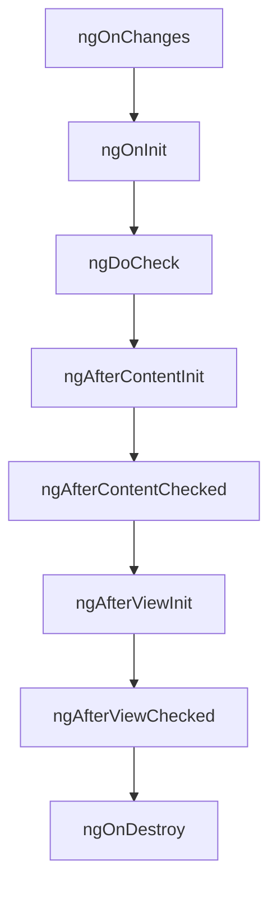

# Angular Lifecycle Hooks

Angular provides a set of lifecycle hooks that give you visibility into key events in the lifecycle of a component or directive. These hooks allow you to tap into specific moments in the lifecycle and perform custom logic.

## Lifecycle Hooks Overview

Here is a diagram that shows the sequence of lifecycle hooks in Angular:



## Lifecycle Hooks in Detail

### ngOnChanges

Called before `ngOnInit` and whenever one or more data-bound input properties change.

```typescript
ngOnChanges(changes: SimpleChanges) {
  console.log('ngOnChanges', changes);
}
```

### ngOnInit

Called once, after the first `ngOnChanges`.

```typescript
ngOnInit() {
  console.log('ngOnInit');
}
```

### ngDoCheck

Called during every change detection run, immediately after `ngOnChanges` and `ngOnInit`.

```typescript
ngDoCheck() {
  console.log('ngDoCheck');
}
```

### ngAfterContentInit

Called once after the first `ngDoCheck`.

```typescript
ngAfterContentInit() {
  console.log('ngAfterContentInit');
}
```

### ngAfterContentChecked

Called after `ngAfterContentInit` and every subsequent `ngDoCheck`.

```typescript
ngAfterContentChecked() {
  console.log('ngAfterContentChecked');
}
```

### ngAfterViewInit

Called once after the first `ngAfterContentChecked`.

```typescript
ngAfterViewInit() {
  console.log('ngAfterViewInit');
}
```

### ngAfterViewChecked

Called after `ngAfterViewInit` and every subsequent `ngAfterContentChecked`.

```typescript
ngAfterViewChecked() {
  console.log('ngAfterViewChecked');
}
```

### ngOnDestroy

Called immediately before Angular destroys the component or directive.

```typescript
ngOnDestroy() {
  console.log('ngOnDestroy');
}
```

## Conclusion

Understanding and utilizing Angular lifecycle hooks can help you manage your components and directives more effectively. Each hook provides a specific point in the lifecycle where you can perform custom logic, making your application more robust and maintainable.
