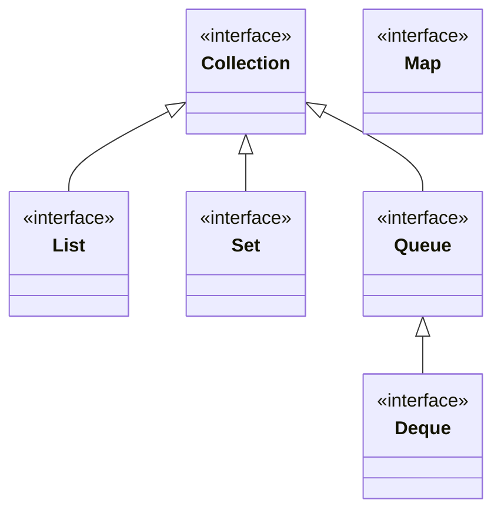

# Introduction to java collections
## Collection Interfaces Diagram

## Collection Interfaces

### 1. Collection Interface
The `Collection` interface is the root of the collection hierarchy. It represents a group of objects known as elements. Some types of collections allow duplicate elements, while others do not.

### 2. List Interface
The `List` interface extends `Collection` and represents an ordered collection. Lists can contain duplicate elements. The user can access elements by their integer index.

### 3. Set Interface
The `Set` interface extends `Collection` and represents a collection that does not allow duplicate elements. It models the mathematical set abstraction.

### 4. Queue Interface
The `Queue` interface extends `Collection` and represents a collection designed for holding elements prior to processing. Queues typically, but do not necessarily, order elements in a FIFO (first-in-first-out) manner.

### 5. Deque Interface
The `Deque` interface extends `Queue` and represents a double-ended queue. It allows the insertion and removal of elements from both ends.

### 6. Map Interface
The `Map` interface is not a true collection but represents a mapping between a key and a value. Maps cannot contain duplicate keys, and each key can map to at most one value.

## Collection Implementations

### 1. ArrayList
`ArrayList` is a resizable array implementation of the `List` interface. It allows random access to elements and can grow as needed.

### 2. LinkedList
`LinkedList` implements both `List` and `Deque` interfaces. It allows for constant-time insertions or removals using iterators.

### 3. HashSet
`HashSet` is an implementation of the `Set` interface backed by a hash table. It does not guarantee any specific order of elements.

### 4. TreeSet
`TreeSet` is an implementation of the `Set` interface that uses a tree for storage. It orders its elements based on their values.

### 5. PriorityQueue
`PriorityQueue` is an implementation of the `Queue` interface that orders its elements according to their natural ordering or by a comparator provided at queue construction time.

### 6. HashMap
`HashMap` is an implementation of the `Map` interface backed by a hash table. It allows null values and the null key.

### 7. TreeMap
`TreeMap` is an implementation of the `Map` interface that uses a tree for storage. It orders its keys based on their natural ordering or by a comparator provided at map creation time.
