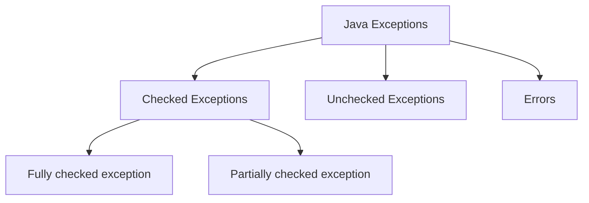

# Exception Handling in Java

Exception Handling in Java is a robust mechanism to address runtime errors, ensuring that the normal flow of an application is maintained. This guide covers the fundamentals of Java exceptions, their types, and practical examples.

## What is an Exception in Java?

An **exception** in Java is an event that disrupts the normal flow of a program during execution. Common causes include invalid user input, file not found, and division by zero. Exceptions in Java are represented as objects derived from the `java.lang.Exception` class.

## Why Use Exception Handling?

Exception Handling ensures smooth execution of the application by managing errors gracefully. Without exception handling, an error might abruptly terminate the program, skipping subsequent code execution. For example:

```java
// Without exception handling
statement 4;
statement 5; // exception occurs
statement 6; // this won't execute
statement 7;
```

## Types of Exception Handling



| **Attribute**            | **Checked Exceptions**                                               | **Unchecked Exceptions**                                                                                  | **Errors**                                              |
| ------------------------ | -------------------------------------------------------------------- | --------------------------------------------------------------------------------------------------------- | ------------------------------------------------------- |
| **Definition**           | Exceptions checked during compile-time. Its derived from `Exception` | Exceptions that occur at runtime and are not checked at compile-time. Its derived from `RuntimeException` | Critical issues often beyond the application's control. |
| **Cause**                | External factors like I/O and database connection                    | Programming bugs like logical error                                                                       |                                                         |
| **Handling requirement** | Must be handled with `try-catch` block or `throws` keyword           | No Handling required                                                                                      |                                                         |
| **Compile-Time Check**   | Yes                                                                  | No                                                                                                        | No                                                      |
| **Examples**             | IOException, SQLException                                            | NullPointerException, ArithmeticException, ArrayIndexOutOfBoundsException                                 | OutOfMemoryError, StackOverflowError                    |
| **Recovery Possible**    | Yes                                                                  | Sometimes                                                                                                 | Rarely                                                  |

## Types of checked exceptions

| **Type**                        | **Description**                                                                                                                                | **Examples**                  |
| ------------------------------- | ---------------------------------------------------------------------------------------------------------------------------------------------- | ----------------------------- |
| **Fully checked exception**     | Exceptions that are checked at compile-time and must be either caught or declared in the method signature. Meaning all subclasses are checked. | `IOException`, `SQLException` |
| **Partially checked exception** | Exceptions that have some subclasses which are checked exceptions and some which are unchecked exceptions.                                     | `Exception` (parent class)    |

## try-catch-finally

### Example: try-catch-finally with Multiple Catch Blocks

Here's an example demonstrating the use of `try-catch-finally` with multiple catch blocks:

```java
public class MultipleCatchExample {
    public static void main(String[] args) {
        try {
            int[] numbers = {1, 2, 3};
            System.out.println(numbers[10]); // This will throw ArrayIndexOutOfBoundsException
        } catch (ArrayIndexOutOfBoundsException e) {
            System.out.println("Array index is out of bounds: " + e.getMessage());
        } catch (ArithmeticException e) {
            System.out.println("Arithmetic exception: " + e.getMessage());
        } catch (Exception e) {
            System.out.println("General exception: " + e.getMessage());
        } finally {
            System.out.println("This block is always executed.");
        }
    }
}
```

In this example:

- The `try` block contains code that may throw exceptions.
- Multiple `catch` blocks handle specific exceptions.
- The `finally` block executes regardless of whether an exception is thrown or caught.

The `try-catch-finally` block is used to handle exceptions in Java. Key points include:

- If an exception occurs in the `try` block, the rest of the code in the `try` block is ignored.
- Multiple `catch` blocks can be used to handle different types of exceptions.
- More specific exceptions should be handled first, followed by more generic exceptions.
- The `finally` block is executed regardless of whether an exception is thrown or caught.
- Multiple exceptions can be handled in a single `catch` block using the pipe (`|`) symbol:
  ```java
  catch(ExceptionType1 | ExceptionType2 ex) {
          // handle exceptions
  }
  ```

## throws

The `throws` keyword is used to specify exceptions that a method can throw. Then the try catch block needs to be added consumer side of this method. For example:

```java
public void sampleMethod() throws Exception1, Exception2 {
        // method implementation
}
```

## Try with Resources

The try-with-resources statement ensures that each resource is closed at the end of the statement. It is an alternative to using a `finally` block for resource management. Examples include:

- Single resource:

  ```java
  try (BufferedReader br = new BufferedReader(new FileReader("test.txt"))) {
          String line;
          while ((line = br.readLine()) != null) {
                  System.out.println("Line => " + line);
          }
  } catch (IOException e) {
          System.out.println("IOException in try block => " + e.getMessage());
  }
  ```

- Multiple resources:

  ```java
  try (Scanner scanner = new Scanner(new File("testRead.txt"));
           PrintWriter writer = new PrintWriter(new File("testWrite.txt"))) {
          while (scanner.hasNext()) {
                  writer.print(scanner.nextLine());
          }
  }
  ```

  In this case, the `PrintWriter` is closed first, followed by the `Scanner`.

- Java 9 supports the declaration of resources outside the try-with-resources statement:
  ```java
  Scanner scanner = new Scanner(new File("test.txt"));
  try (scanner) {
          // use scanner
  } catch (IOException e) {
          // handle exception
  }
  ```

## Custom/User-defined exceptions

- Custom exception is a class extending 
    - `Exception` (for checked exception) and 
    - `RuntimeException` (for unchecked exception) class.
  ```java

  // checked exception
  public class InvalidPriceException extends Exception {
      public InvalidPriceException(String message) {
          super(message);
      }
  }

  // unchecked exception
  public class DivideByZeroException extends RuntimeException {
    public DivideByZeroException(String message) {
        super(message);
    }
  }
  ```
- Further this can be thrown like `throw new CustomException("Custom exception occurred.")`

## Some commonly used exceptions
| **Exception Type** | **Exception**                  | **Description**                                                                 |
| ------------------ | ------------------------------ | ------------------------------------------------------------------------------- |
| Checked            | `IOException`                  | Occurs when an I/O operation fails or is interrupted.                           |
| Checked            | `SQLException`                 | Occurs when there is an error in accessing the database.                        |
| Unchecked          | `NullPointerException`         | Occurs when an application attempts to use `null` in a case where an object is required. |
| Unchecked          | `ArithmeticException`          | Occurs when an exceptional arithmetic condition has occurred, such as division by zero. |
| Unchecked          | `ArrayIndexOutOfBoundsException` | Occurs when an array has been accessed with an illegal index.                   |
| Unchecked          | `IllegalArgumentException`     | Occurs when a method receives an argument formatted differently than the method expects. |
| Unchecked          | `NumberFormatException`        | Occurs when an attempt is made to convert a string to a numeric type, but the string does not have the appropriate format. |
| Error              | `OutOfMemoryError`             | Occurs when the Java Virtual Machine cannot allocate an object because it is out of memory. |
| Error              | `StackOverflowError`           | Occurs when a stack overflow occurs in the Java Virtual Machine.                |


## Chained Exceptions

Chained exceptions allow you to relate one exception to another, forming a chain of exceptions. This is useful when you want to capture the original cause of an exception and propagate it up the call stack. The `Throwable` class provides the `initCause()` method and a constructor that accepts a `Throwable` cause.
1. **initCause()**: Associates a cause with this throwable. This method is used to set the cause of the throwable after it has been created.
2. **getCause()**: Retrieves the cause of this throwable or null if the cause is nonexistent or unknown. This method returns the cause that was provided during the throwable's creation or via the initCause() method.

### Example: Chained Exceptions with `initCause`

Here's a real-world example demonstrating the use of chained exceptions with the `initCause` method:

```java
import java.io.IOException;

public class ChainedExceptionExample {
  public static void main(String[] args) {
    try {
      processFile();
    } catch (CustomException e) {
      System.out.println("Caught exception: " + e);
      System.out.println("Original cause: " + e.getCause());
    }
  }

  public static void processFile() throws CustomException {
    try {
      readFile();
    } catch (IOException e) {
      CustomException customException = new CustomException("Error processing file");
      customException.initCause(e);
      throw customException;
    }
  }

  public static void readFile() throws IOException {
    throw new IOException("File not found");
  }
}

class CustomException extends Exception {
  public CustomException(String message) {
    super(message);
  }
}
```

In this example:

- `readFile` throws an `IOException`.
- `processFile` catches the `IOException` and creates a `CustomException`, setting the original `IOException` as the cause using `initCause`.
- The `main` method catches the `CustomException` and prints both the caught exception and its original cause.

Chained exceptions help in debugging by providing a clear trace of the sequence of events leading to the exception.
### Advantages chained exceptions
- **Enhanced Debugging**: Provides a clear trace of the sequence of events leading to the exception.
- **Root Cause Identification**: Helps in identifying the original cause of the exception.
- **Better Error Handling**: Allows for more precise and informative error messages.
- **Simplified Code**: Reduces the need for multiple catch blocks by chaining exceptions.
- **Improved Maintainability**: Makes the code easier to maintain and understand by linking related exceptions.

## Handling Exception with Method Overriding

When overriding methods in Java, it's important to handle exceptions properly to ensure consistency and reliability in your code. Here are key points to consider:

- **Checked Exceptions**:
  - The overriding method can throw the same checked exceptions as the overridden method.
  - It can also throw subclasses of the exceptions declared in the overridden method.
  - It cannot throw new or broader checked exceptions than those declared in the overridden method.

- **Unchecked Exceptions**:
  - The overriding method can throw any unchecked exceptions, regardless of the overridden method's exception declarations.

### Example: Handling Exceptions with Method Overriding

Here's a real-world example demonstrating exception handling with method overriding:

```java
class Parent {
    public void display() throws IOException {
        // Simulate an I/O operation that may throw an IOException
        throw new IOException("Parent IOException");
    }
}

class Child extends Parent {
    @Override
    public void display() throws FileNotFoundException {
        // Simulate a file operation that may throw a FileNotFoundException
        throw new FileNotFoundException("Child FileNotFoundException");
    }
}

public class ExceptionHandlingExample {
    public static void main(String[] args) {
        Parent obj = new Child();
        try {
            obj.display();
        } catch (IOException e) {
            System.out.println("Caught exception: " + e.getMessage());
        }
    }
}
```

In this example:
- The `Parent` class declares a method `display` that throws an `IOException`.
- The `Child` class overrides the `display` method and throws a `FileNotFoundException`, a subclass of `IOException`.
- The `main` method catches the `IOException` thrown by the `Child` class.

### Key Points:
- **Consistency**: Ensure the overriding method's exceptions are consistent with the overridden method.
- **Flexibility**: Use unchecked exceptions for flexibility in the overriding method.
- **Polymorphism**: Handle exceptions in a polymorphic way to maintain code reliability.

Proper exception handling with method overriding enhances code robustness and maintainability.
