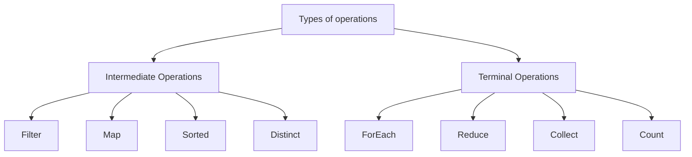

# Java streams

Java streams were introduced in `Java 8`. Its present in `java.util.stream` package.

## What is stream?

Stream is a sequence of elements supporting sequential and parallel operations in declarative manner.
It allows to perform complex operations on collection in functional-style.

## Features of stream

1. It takes input from collections, arrays or I/O channels and processes it through a pipeline of computational operations. While doing this it `doesn't store the data`.
2. While operating on data it `doesn't make any changes to source`. Ex. if array is used as source to create stream and then filtered. This doesn't removes elements from source i.e. array.
3. Each operations in streams are `lazily evaluated` & not eagerly.

## How to create stream

Declaration syntax

```java
Stream<T> stream;
```

Following are different ways of creating a stream.

| **Source**           | **Method**                    | **Example**                                                                                      |
| -------------------- | ----------------------------- | ------------------------------------------------------------------------------------------------ |
| **From Collections** | `Stream.of()`                 | `Stream<String> stream = Stream.of("A", "B", "C");`                                              |
|                      | `Collection.stream()`         | `List<String> list = Arrays.asList("A", "B", "C");`<br/>`Stream<String> stream = list.stream();` |
|                      | `Collection.parallelStream()` | `Stream<String> parallelStream = list.parallelStream();`                                         |
| **From Arrays**      | `Arrays.stream()`             | `String[] array = {"A", "B", "C"};`<br/>`Stream<String> stream = Arrays.stream(array);`          |
| **From Files**       | `Files.lines()`               | `Stream<String> stream = Files.lines(Paths.get("file.txt"));`                                    |
| **From Generators**  | `Stream.generate()`           | `Stream<Double> stream = Stream.generate(Math::random);`                                         |
|                      | `Stream.iterate()`            | `Stream<Integer> stream = Stream.iterate(0, n -> n + 1);`                                        |
| **From a Pattern**   | `Pattern.splitAsStream()`     | `Stream<String> stream = Pattern.compile(",").splitAsStream("A,B,C");`                           |
| **Empty Stream**     | `Stream.empty()`              | `Stream<String> emptyStream = Stream.empty();`                                                   |

## Types of operations



### 1. Intermediate operations

- Intermediate operations are those methods which can be `chained` together to perform operations.
- They are `lazy` (i.e. do not start processing right away) and only evaluated when terminal operation is called. Following are the common intermediate operations

#### 1. Map

Transforms elements of stream in other form.

```java
Stream<Integer> mapped = Stream.of(1,2,3,4).map(v => v*2);
// 2, 4, 6, 8
```

#### 2. Filter

Selects elements from stream with specified condition (i.e. predicate)

```java
Stream<Integer> evenNumberStream = Stream.of(1,2,3,4).filter(v => v%2 == 0);
// 2, 4
```

#### 3. FlatMap

Flattens stream of collections into a single stream

```java
List<List<Integer>> listOfLists = Arrays.asList(
    Arrays.asList(1, 2, 3),
    Arrays.asList(4, 5, 6),
    Arrays.asList(7, 8, 9)
);

// Using flatMap to flatten the list of lists into a single stream of integers
List<Integer> flattenedList = listOfLists.stream()
    .flatMap(List::stream)
```

#### 4. Sorted

Sorts the elements from stream

```java
Stream<Integer> sortedStream = Stream.of(4,3,1,2).sorted();
// 1,2,3,4
```

#### 5. Distinct

Removes duplicate elements and provides only unique elements at output

```java
Stream<Integer> uniqueStream = Stream.of(1,2,3,1,2).distinct();
// 1,2,3
```

#### 6. Peek

Allow operating on single element at a time in stream chain. This is mainly used for debugging purposes.

```java
Stream<Integer> peekOperation = Stream.of(1,2,3).peek(System.out::println);
// 1 2 3
```

#### 7. Limit

Limits the stream to the first few specified count of elements.

```java
Stream<Integer> limitedStream = Stream.of(1,2,3,4).limit(2);
// 1, 2
```

#### 8. Skip

Skips first n elements from stream

```java
Stream<Integer> skippedStream = Stream.of(1,2,3,4).skip(2);
// 3,4
```

### 2. Terminal operations

These operations produces result or side-effect and mark the end of stream pipeline. Once terminal operation is invoked, the stream is completely processed and it can't be reused.

#### 1. ForEach

Performs operation of each element in stream. For parallel stream it doesn't guarantee to respect order of elements in stream.

```java
Stream.of(1,2,3).forEach(System.out::println);
// 1 2 3

// in case of parallel stream order is not respected
Stream.of(1,2,3).parallel().forEach(System.out::println);
// 3 1 2
```

#### 2. ForEachOrdered

Similar to forEach it performs operation on each element from stream but it respects encounter order of elements, even in parallel streams.

```java
Stream.of(1,2,3).parallel().forEachOrdered(System.out::println);
// 1 2 3
```

#### 3. Collect

Performs mutable reduction operation on elements of stream. Meaning the reduced value is mutable result container like ArrayList. Its used to transform elements to List, Set, Map etc.

```java
Stream.of(1,2,3).collect(Collectors.toList());
// [1, 2, 3]

Stream.of(1,2,3).collect(Collectors.toSet());
// [1, 2, 3]

Stream.of("sam","alan","justin").collect(Collectors.toMap(name -> name, String::length));
// {sam=3, alan=4, justin=6}

// grouping strings by first letter
Stream.of("sam","alan","alex","justin").collect(Collectors.groupingBy(name -> name.charAt(0)));
// {s=[sam],a=[alan,alex],j=[justin]}

// partitioning into two groups
Stream.of(1,2,3,4,5).collect(Collectors.partitioningBy(v -> v>3));
// {false=[1,2,3],true=[4,5]}

//collecting with joining
String names = Stream.of("a", "b", "c").collect(Collectors.joining("_"));
// a_b_c
```

#### 4. Reduce

Reduces elements of stream to a single value using associative accumulation function

```java
//sum of elements
int sum = IntStream.range(1,4).reduce(0, Integer::sum);
// 6 (1+2+3)
String result = Stream.of("a", "b", "c").reduce((acc, item) -> acc+item);
// abc
```

#### 5. Count

Returns `count` of elements of stream.

```java
long count = IntStream.range(1,4).count();
// 3 (1,2,3)
```

#### 6. AnyMatch

Returns true if `any element` from stream matches given predicate. Returns `false` if stream is empty, at that time the predicate is not evaluated.
This is short circuiting terminal operation.

```java
boolean startsWithA = Stream.of("apple", "banana", "cherry")
                              .anyMatch(s -> s.startsWith("a"));
// true

boolean hasGreaterThan10 = Stream.of(1,2,3).anyMatch(v -> v>10);
//false
```

#### 7. AllMatch

Returns true if `all elements` from stream matches given predicate. This is short circuiting terminal operation. If the stream is empty then `true` is returned.

```java
boolean isEven = Stream.of(2,4,6).allMatch(v -> v%2==0);
//true
```

#### 8. NoneMatch

Returns true if `no elements` from stream matches given predicate. This is short circuiting terminal operation. It returns `true` when the stream is empty.

```java
boolean noEven = Stream.of(1, 3, 5, 7)
                        .noneMatch(num -> num % 2 == 0);
// true
```

#### 9. FindFirst

Returns `Optional` describing first element of stream. If stream is empty then empty Optional is returned. If stream has no encounter order then any element may be returned. This is short circuiting terminal operation.

```java
Stream.of("apple", "banana", "cherry");
      .findFirst()
      .ifPresent(System.out::println);
// Output: apple

Stream.empty()
      .findFirst()
      .ifPresentOrElse(
          System.out::println,
          () -> System.out.println("No elements found!")
      );
// Output: No elements found!
```
