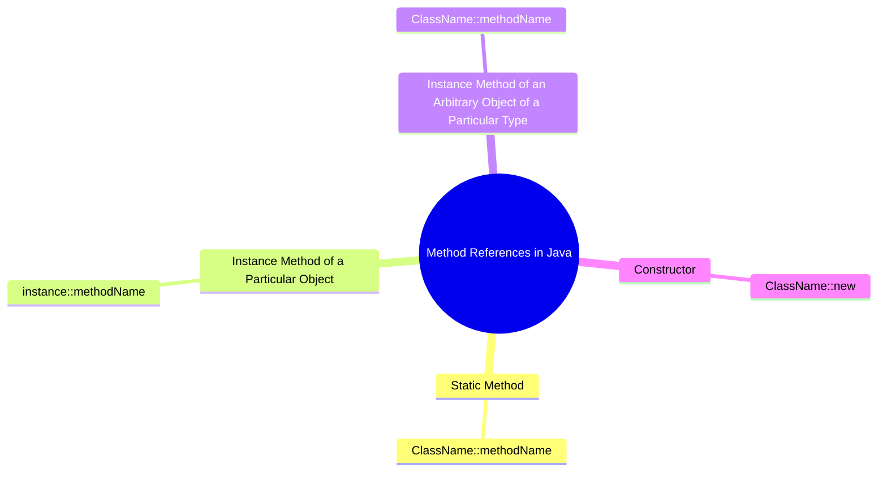

# Method References in Java

Method references in Java provide a way to refer to methods without invoking them. They are a shorthand notation of a lambda expression to call a method. Method references can be used to refer to a method in four different ways:


## 1. Reference to a Static Method

Syntax: `ClassName::methodName`

### Example:
```java
import java.util.function.BiFunction;

public class StaticMethodReference {
  public static int add(int a, int b) {
    return a + b;
  }

  public static void main(String[] args) {
    BiFunction<Integer, Integer, Integer> addition = StaticMethodReference::add;
    int result = addition.apply(10, 20);
    System.out.println("Result: " + result); // Output: Result: 30
  }
}
```

## 2. Reference to an Instance Method of a Particular Object

Syntax: `instance::methodName`

### Example:
```java
import java.util.function.Supplier;

public class InstanceMethodReference {
  public String getMessage() {
    return "Hello, World!";
  }

  public static void main(String[] args) {
    InstanceMethodReference obj = new InstanceMethodReference();
    Supplier<String> messageSupplier = obj::getMessage;
    System.out.println(messageSupplier.get()); // Output: Hello, World!
  }
}
```

## 3. Reference to an Instance Method of an Arbitrary Object of a Particular Type

Syntax: `ClassName::methodName`

### Example:
```java
import java.util.Arrays;
import java.util.List;

public class ArbitraryObjectMethodReference {
  public static void main(String[] args) {
    List<String> names = Arrays.asList("Alice", "Bob", "Charlie");
    names.forEach(System.out::println);
    // Output:
    // Alice
    // Bob
    // Charlie
  }
}
```

## 4. Reference to a Constructor

Syntax: `ClassName::new`

### Example:
```java
import java.util.function.Supplier;

public class ConstructorReference {
  public ConstructorReference() {
    System.out.println("Constructor called!");
  }

  public static void main(String[] args) {
    Supplier<ConstructorReference> supplier = ConstructorReference::new;
    supplier.get(); // Output: Constructor called!
  }
}
```

## Common Use Cases

1. **Sorting Collections**:
  Method references can be used to sort collections more concisely.
  ```java
  import java.util.Arrays;
  import java.util.List;
  import java.util.Collections;

  public class SortingExample {
    public static void main(String[] args) {
     List<String> names = Arrays.asList("John", "Alice", "Bob");
     Collections.sort(names, String::compareToIgnoreCase);
     System.out.println(names); // Output: [Alice, Bob, John]
    }
  }
  ```

2. **Event Handling in GUI Applications**:
  Method references can simplify event handling code in GUI applications.
  ```java
  import javax.swing.JButton;
  import javax.swing.JFrame;

  public class EventHandlingExample {
    public static void main(String[] args) {
     JFrame frame = new JFrame("Button Example");
     JButton button = new JButton("Click Me");

     button.addActionListener(System.out::println);

     frame.add(button);
     frame.setSize(200, 200);
     frame.setDefaultCloseOperation(JFrame.EXIT_ON_CLOSE);
     frame.setVisible(true);
    }
  }
  ```

3. **Creating Threads**:
  Method references can be used to create threads more succinctly.
  ```java
  public class ThreadExample {
    public static void main(String[] args) {
     Runnable task = ThreadExample::printMessage;
     Thread thread = new Thread(task);
     thread.start();
    }

    public static void printMessage() {
     System.out.println("Hello from a thread!");
    }
  }
  ```

4. **Working with Streams**:
  Method references are often used with Java Streams for operations like filtering, mapping, and reducing.
  ```java
  import java.util.Arrays;
  import java.util.List;

  public class StreamExample {
    public static void main(String[] args) {
     List<String> names = Arrays.asList("John", "Alice", "Bob");
     names.stream()
        .map(String::toUpperCase)
        .forEach(System.out::println);
     // Output:
     // JOHN
     // ALICE
     // BOB
    }
  }
  ```

These examples demonstrate how method references can simplify and enhance the readability of your code in various scenarios. They are particularly useful in functional programming with Java streams and lambda expressions.
